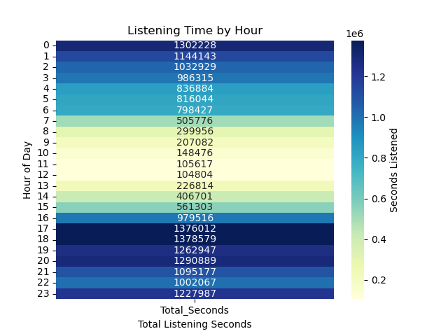
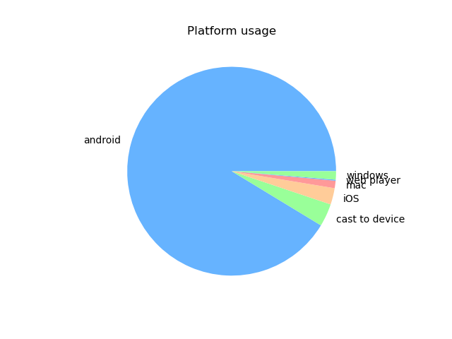
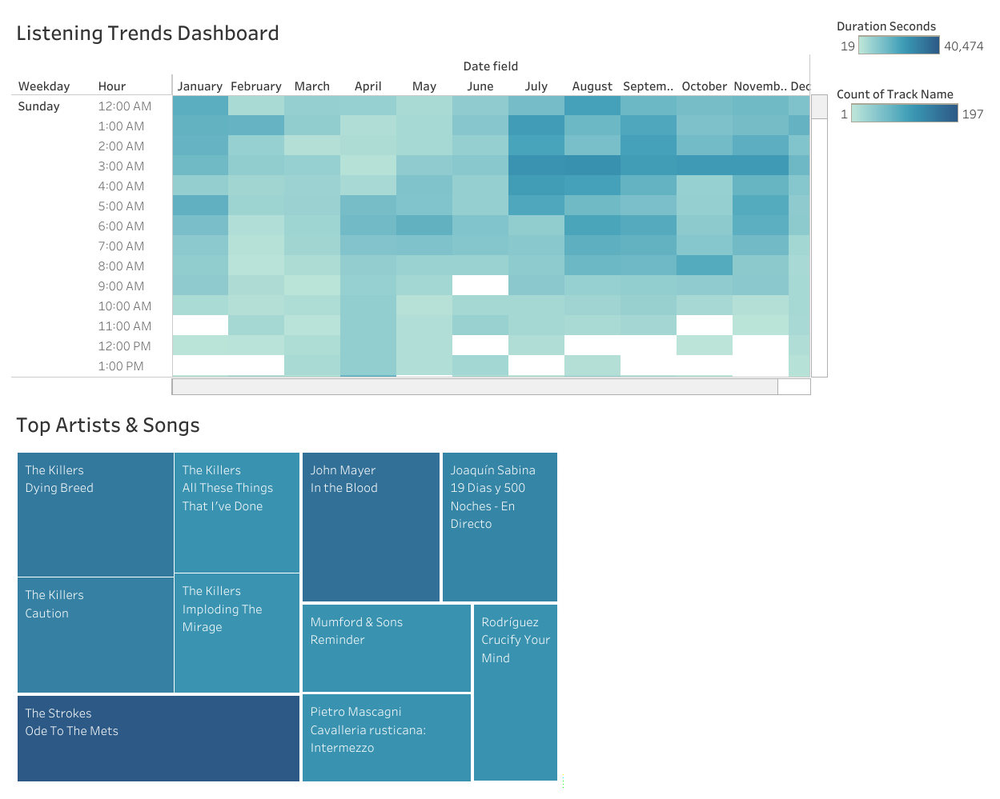

# 🎶 Spotify Listening History Data Analytics Project

This project explores and analyzes my Spotify listening history using **Python (Jupyter Notebook)** and **Tableau**. The goal is to clean, process, and visualize listening patterns to uncover insights about my music habits.

---

## 📂 Project Structure

```
├── data/
│   ├── spotify_data_dictionary Description.csv   # Data dictionary for spotify_history.csv
│   ├── spotify_history.csv                       # Raw listening history dataset
│   └── clean data/
│       └── clean_Spotify_data.xlsx               # Cleaned dataset after preprocessing
│
├── jupyter_notebook/
│   └── Spotify_history.ipynb                     # Python notebook for data cleaning & EDA
│
├── visuals/
│   ├── Tableau_visual/
│   │   ├── Spotify_History_Project.twb           # Tableau workbook with dashboards
│   │   ├── Tableau_Spotify_data_visualization.png # Partial PNG preview of treemap
│   │   └── Tableau Public Link:
│   │       https://public.tableau.com/app/profile/ameer.sulyans2376/viz/Spotify_History_Project/Dashboard
│   │
│   └── python_visuals/                           # Visuals exported from Jupyter Notebook
│       ├── Listening_Time_by_Hour_Heatmap.png
│       ├── Most_skip_artist.png
│       ├── Platform_Usage.png
│       ├── Top_10_Albums_by_listening_time.png
│       └── Top_Artists.png
```

---

## 🔧 Methods & Workflow

**Jupyter Notebook (Python):**

* Imported & explored the dataset (`spotify_history.csv`).
* Cleaned data: handled missing values, converted timestamps, added new features (year, month, day, hour).
* Converted `ms_played` into minutes/seconds.
* Filtered out short plays (< 15s) to remove accidental clicks.
* Performed **Exploratory Data Analysis (EDA):**

  * Top artists & tracks by total minutes played
  * Listening habits by hour of the day
  * Platform usage (web, mobile, etc.)
  * Skip behavior analysis
  * Album listening trends
* Visualizations created in Python:

  * **Bar Chart** – Top 10 Artists
  * **Heatmap** – Listening by day & hour
  * **Pie Chart** – Platform usage
  * **Bar Chart** – Top skipped songs
  * **Line Graph** – Album listening trends

**Tableau Project:**

* Built dashboards with:

  * Heatmap of listening trends
  * Treemap of top artists & songs
* Tableau Public link: [Spotify History Dashboard](https://public.tableau.com/app/profile/ameer.sulyans2376/viz/Spotify_History_Project/Dashboard)

---

## 📊 Key Insights

### From Python Visuals:

* **Listening Time by Hour (Heatmap):**
  Most listening happens around **6:00 PM** (1,378,579 seconds).

* **Most Skipped Artist:**
  The **Beatles** were skipped the most.

* **Platform Usage:**
  **Android** was used significantly more than Windows, Web Player, iOS, or Cast to Device.

* **Top 10 Albums by Listening Time:**

  * 🎵 *The New Abnormal* (The Strokes) was the most played album.
  * 🎵 The Beatles followed as the second most played.

* **Top Artists:**

  * 🎤 The **Beatles** were the most listened-to artist.
  * 🎤 The **Killers** were second.

### From Tableau:

* The **Top Artist & Song** was *"Ode to the Mets"* by The Strokes.

---

## 📷 Sample Visualizations

**Listening Time by Hour (Python Heatmap):**


**Platform Usage (Python Pie Chart):**


**Tableau Dashboard (Treemap & Heatmap):**


---

## 🚀 Tools & Technologies

* **Python (Pandas, Matplotlib, Seaborn, Numpy)**
* **Jupyter Notebook**
* **Tableau Public**
